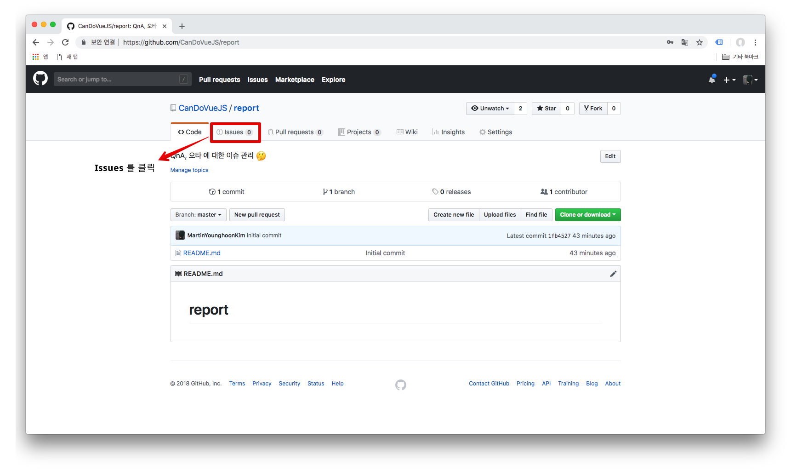
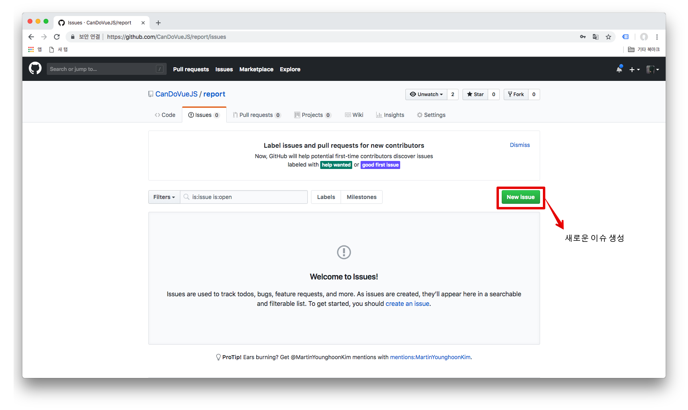
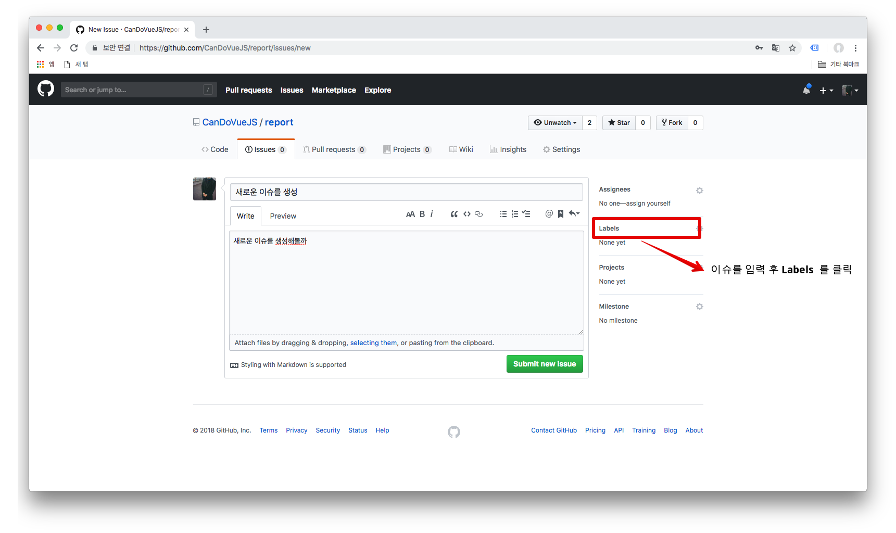
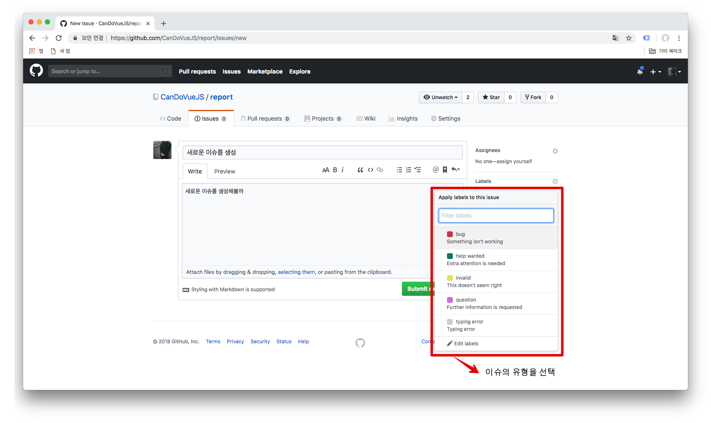
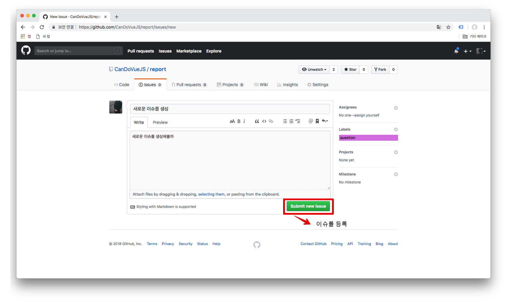
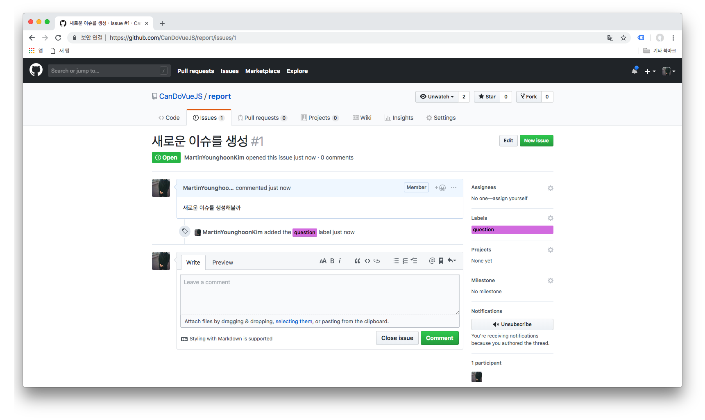

## Report
CanDoVueJS(가제) 관련해서 오타, 질문 혹은 코드가 동작하지 않을 경우 아래의 방법에 따라 이슈로 남겨주시면 최대한 빨리 회신드리도록 하겠습니다.

### 책 내용에 대한 업데이트
해당 레파지토리 안에는 책 내의 오타 및 오작동하는 코드에 대한 수정 사항들이 추가되어있습니다. 책의 예제를 보시면서 동작하지 않는 부분은 해당 레파지토리 내에 페이지 별로 구분되어져 있으므로 확인하시어 진행하시기 바랍니다.

#### Chapter 5 메모 애플리케이션 만들기
- [p.169내의 코드 누락](./fixed/chapter5/p169.md)

### 종류에 따라 이슈를 남기는 법
#### 1. [Report](https://github.com/CanDoVueJS/report) 레파지토리 혹은 챕터별 각 레파지토리로 이동한다.
#### 2. 상단 `Issues` 를 클릭한다.

#### 3. 새로운 이슈를 생성한다.

#### 4. 새로운 이슈를 작성 후, `Labels` 버튼을 클릭한다.

#### 5. 이슈의 유형을 선택한다.

> - **bug**: 예제 코드 자체에 오류가 있어 코드가 정상적으로 작동하지 않을 경우
> - **help wanted**: 예제를 진행함에 있어 도움이 필요한 경우
> - **invalid**: 내용 중 수정해야할 잘못된 내용이 있을 경우
> - **question**: 내용 자체에 대한 추가적인 질문이 있을 경우
> - **typing error**: 오타가 있을 경우

#### 6. 이슈의 유형 선택을 완료 후, 이슈를 등록한다.

#### 7. 이슈가 정상적으로 등록된 것을 확인한다.

